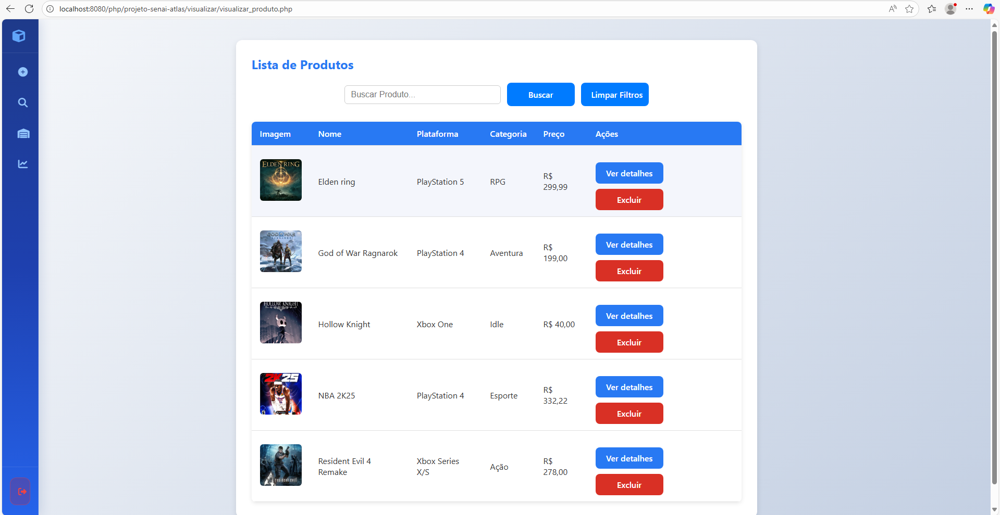
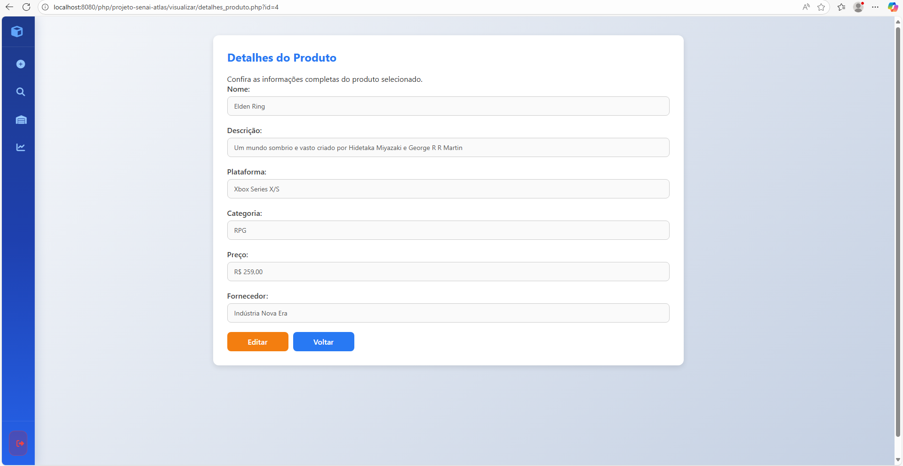
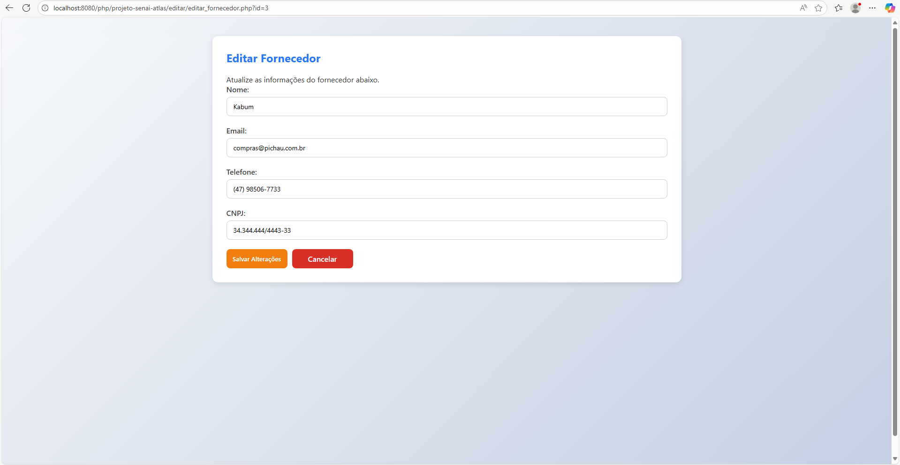
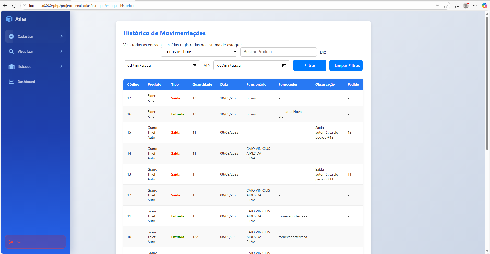

# Sistema de Gestão de Estoque — Distribuidora de Jogos - Atlas

## 🧩 Visão Geral

Este sistema foi desenvolvido para gerenciar o estoque de uma distribuidora de jogos, permitindo o controle eficiente de produtos, fornecedores, clientes e movimentações de entrada e saída. Utiliza **PHP com MySQL** como banco de dados relacional, garantindo confiabilidade, desempenho e facilidade de integração.

A interface é construída com **HTML**, **CSS** e **JavaScript**, com navegação fluida via **sidebar dinâmica** e ações realizadas em **modais interativos**, sem recarregamento de página.

Este projeto foi desenvolvido como parte de uma **Situação de Aprendizagem (SA)** no **terceiro semestre do curso técnico em Desenvolvimento de Sistemas**, com foco em aplicação prática de conceitos de programação web, banco de dados e organização modular.

---

## 🚀 Funcionalidades

- Cadastro e listagem de jogos em estoque  
- Registro de entradas e saídas de produtos  
- Visualização de detalhes em janelas modais  
- Edição de dados diretamente via modal  
- Exclusão com confirmação  
- Organização modular por tipo de entidade: jogos, clientes, fornecedores, funcionários  
- Navegação lateral com categorias dinâmicas  
- Relatórios básicos de movimentação e estoque  
- Interface responsiva com paleta de cores personalizada  

---

## 🛠️ Tecnologias Utilizadas

- PHP 7.4+  
- MySQL 5.7+  
- HTML5 & CSS3  
- JavaScript (vanilla)  
- Fontes e variáveis CSS para identidade visual  

---

## ⚙️ Configuração do Banco de Dados (MySQL)

1. Crie um banco de dados chamado `atlas_db`  
2. Execute os scripts de criação de tabelas presentes na pasta de configs  

---

## 👥 Colaboradores

Este projeto foi desenvolvido com dedicação por:

- **Caio Vinicius** — Desenvolvedor Full Stack, responsável pela arquitetura geral, integração com banco de dados e interface dinâmica.  
- **Daniel Balera** — Especialista em banco de dados e segurança, cuidou da estrutura do banco de dados e autenticações.  
- **Matheus Eduardo** — Apoio geral na interface e contribuições em diferentes partes do projeto.  

---

## 🖼️ Imagens do Sistema

### Tela de Listagem de Jogos  

### Detalhes do Produto  

### Tela de Edição  

---

## 📈 Relatórios e Movimentações

O sistema permite visualizar movimentações de entrada e saída de estoque com filtros por data, produto e fornecedor.

---

## 📌 Observações Finais

- O sistema é modular e expansível, podendo incluir novos tipos de entidades como categorias, promoções ou usuários administrativos.  
- A estrutura de modais permite uma navegação fluida sem recarregamento de página.  
- A paleta de cores e tipografia seguem o padrão definido em `:root` no CSS, facilitando a personalização visual.  

---

## 📄 Licença

Este projeto é de uso interno da equipe de desenvolvimento e não possui licença pública definida. Para uso externo ou comercial, entre em contato com os autores.

---

## 📬 Contato

Para dúvidas, sugestões ou contribuições:

- [caioviniaires@gmail.com](mailto:caioviniaires@gmail.com)  
- [danielbalera021@gmail.com](mailto:danielbalera021@gmail.com)  
- [matheusesouza_@hotmail.com](mailto:matheusesouza_@hotmail.com)
